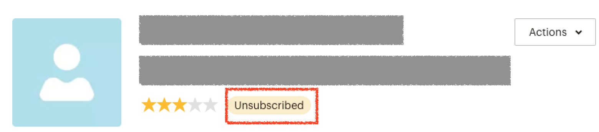
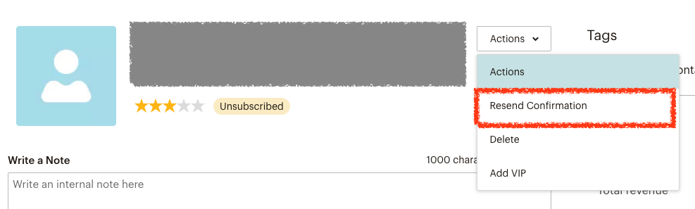
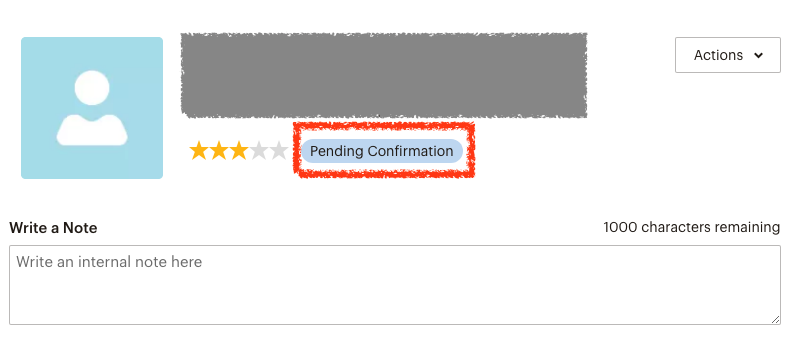
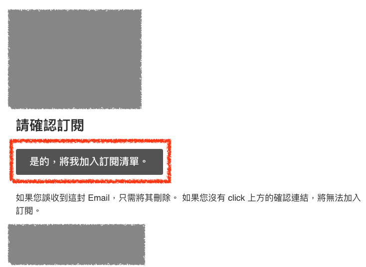

# 讓取消訂閱的讀者重新訂閱電子報

當讀者在電子報中點選 `取消訂閱` 連結時，讀者在 Mailchimp 的訂閱狀態就會變成 `unsubscribed`，在使用 API 嘗試修改使用者訂閱狀態則會回傳下列訊息

> `xxx@xxx.xxx` is in a compliance state due to unsubscribe, bounce, or compliance review and cannot be subscribed.

此時到 Mailchimp 後台搜尋使用者 Email 會看到狀態為 `unsubscribed`

若要讓使用者重新訂閱，可以點選 `Action` 選單下的 `Resend Confirmation` 按鈕，重新寄送訂閱確認信給使用者

再重新寄送過後，使用者的狀態就會變成 `Pending Confirmation`

此時使用者則會收到一封確認訂閱的信件，點選重新加入訂閱清單的連結，這樣使用者的狀態就可以變成 `subscribed` 了

## 參考資料
* [subscribe - Resubscribe a user to a MailChimp list after unsubscribe - Stack Overflow](https://stackoverflow.com/questions/42159327/resubscribe-a-user-to-a-mailchimp-list-after-unsubscribe)
