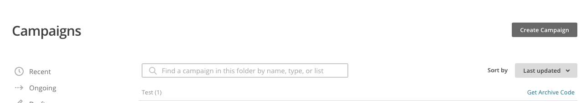
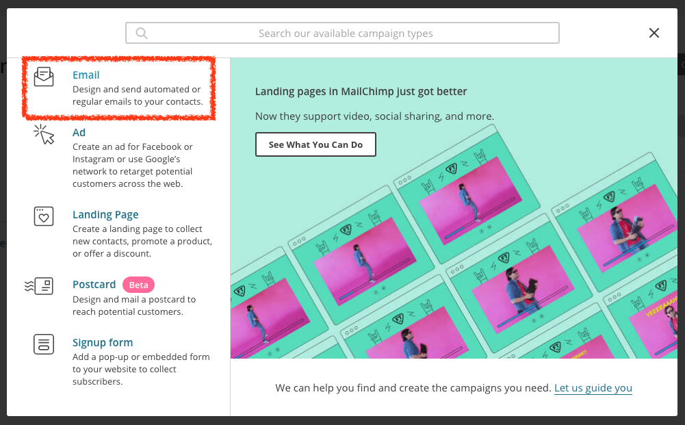
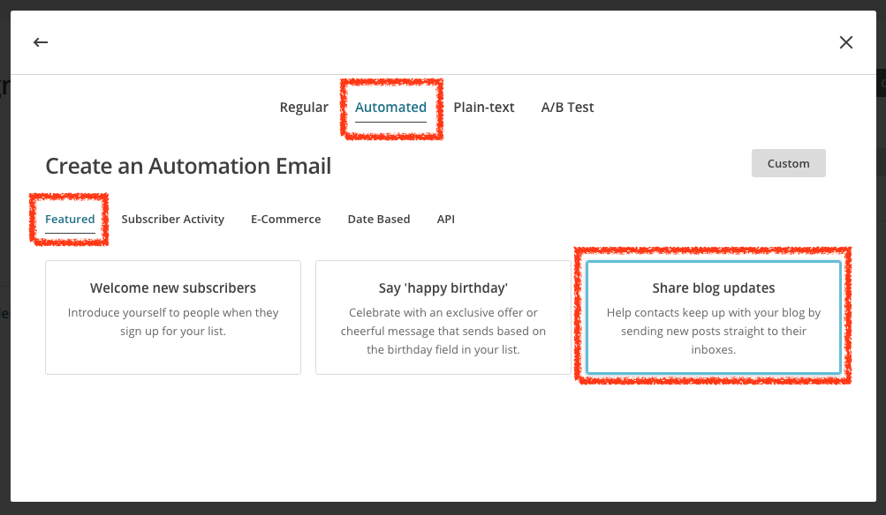
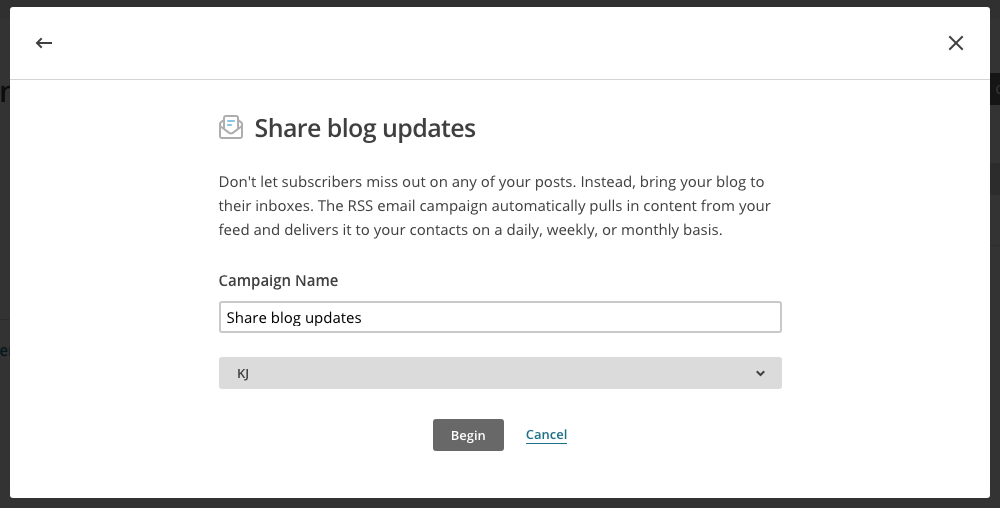
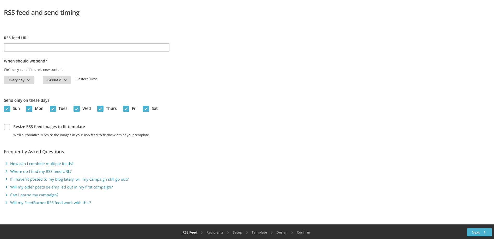
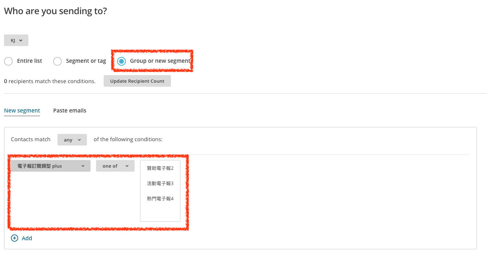

# RSS 電子報

*1. 建立 Campaign*

*2. 選擇 Email Campaign*

*3. 選擇 Email Campaign 類型*

`Automated` > `Featured` > `Share blog updates`

*4. 設定 Email Campaign 名稱*

*5. 設定 Email Campaign RSS Feed*

*6. 設定 Email Campaign 傳送清單*

