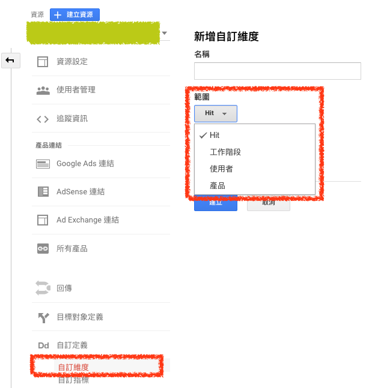

# Google Analytics Custom Dimension 自訂維度

## 自訂維度範圍

- 產品 – 將值套用至已設定此值的產品 (僅限「加強型電子商務」)。
- 匹配 – 將值套用至已設定此值的單次匹配。
- 工作階段 – 將值套用至單一工作階段中的所有匹配。
- 使用者 - 將值套用至目前和未來工作階段中的所有匹配，直到此值變更或自訂維度不再有效為止。

*產品*

`指定頁面` 設定指定產品數值資料

*匹配（HIT）*

單一個 PV 會有自己的紀錄資料

PV1 的 Custom Dimension 若為 1 的話，會記錄資料 1，若之後再度造訪此頁面，將 Custom Dimension 設定為 2 時，會再記錄 2

*工作階段*

在同一個工作階段，會記錄成相同的值

工作階段時間範圍為 30 分鐘，在第一次造訪 Custom Dimension 若為 1 會記錄資料為 1，若在工作階段中最後時間造訪，將 Custom Dimension 設為 99 時，則前面所有的 Custom Dimension 皆會設定為 99

*使用者*

同一個使用者造訪頁面，會紀錄同一個 Custom Dimension 的資料

## 參考資料
* [自訂維度和指標 - Analytics (分析)說明](https://support.google.com/analytics/answer/2709828?hl=zh-Hant)
* [Custom dimensions and metrics with gtag.js  |  Analytics for Web (gtag.js)  |  Google Developers](https://developers.google.com/analytics/devguides/collection/gtagjs/custom-dims-mets)
