# Line Message API


## 建立 Line Message API Channel

在 Line Developers 點選 `Crete new channel` 按鈕，建立新頻道

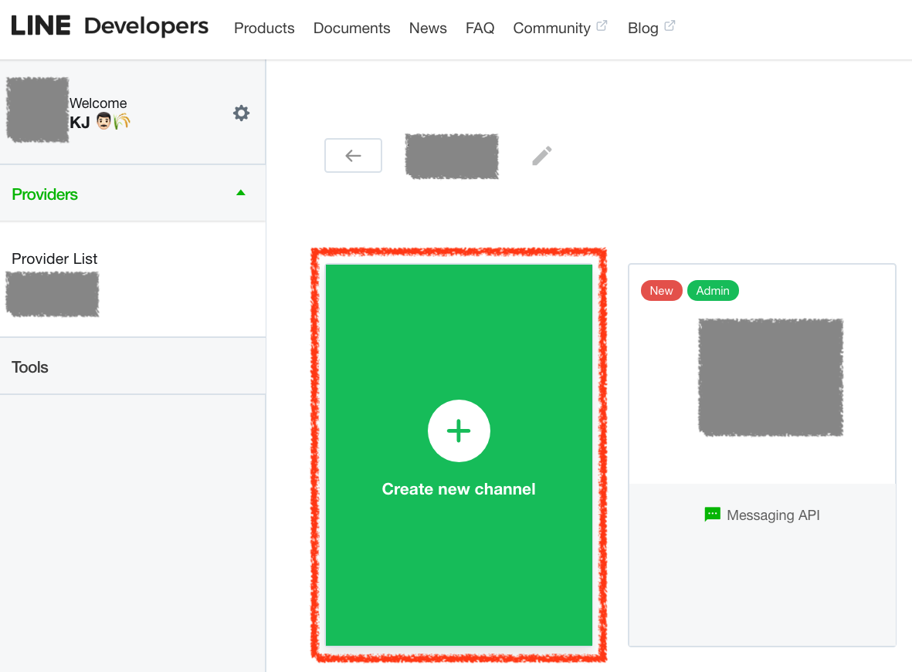

頻道類型選擇 `Messaging API`

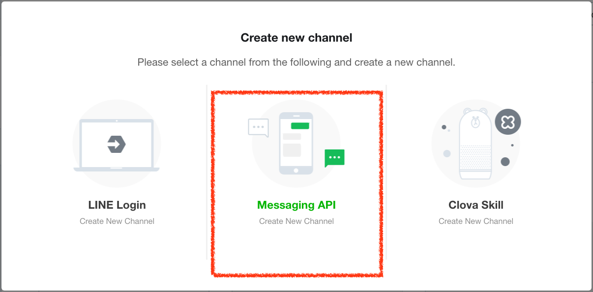

輸入 `App 名稱` 及選擇 `方案` 為 `Developer Trial`

> `Developer Trial` 方案才可以不用付費進行推送訊息 Push Message 測試

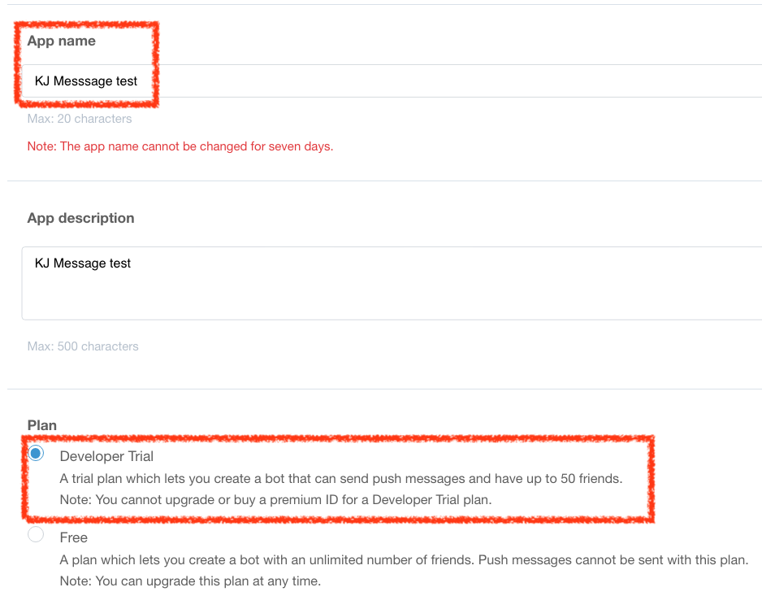

同意使用條款

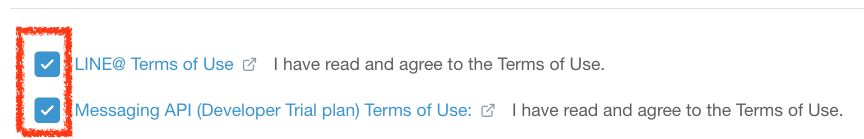

建立 `Line Message API Channel` 完成

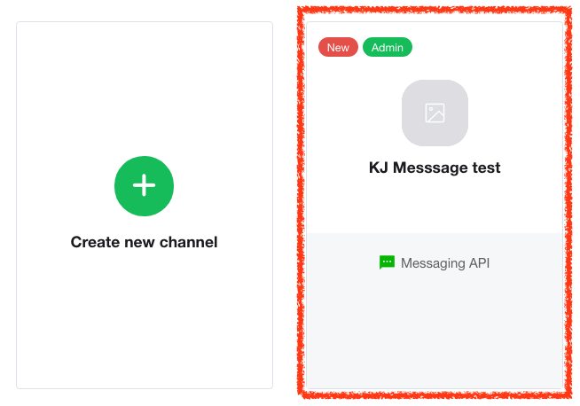


## 使用 Line Message API 傳送訊息

以 Line PHP 套件 [GitHub - line/line-bot-sdk-php: SDK of the LINE Messaging API for PHP](https://github.com/line/line-bot-sdk-php) 為例

**安裝 Line PHP 套件**

```shell
composer require linecorp/line-bot-sdk
```

**建立 LineBot Client**

```php
<?php
$httpClient = new \LINE\LINEBot\HTTPClient\CurlHTTPClient('<channel access token>');
$bot = new \LINE\LINEBot($httpClient, ['channelSecret' => '<channel secret>']);
```

**取得 LineBot Client <channel access token> 及 <channel secret>**

在程式碼中的 `<channel access token>` 及 `<channel secret>` 都可以在頻道設定中找到


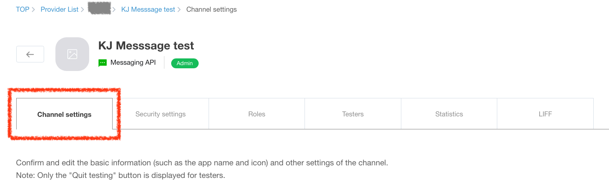

在下方即可找到相關 token

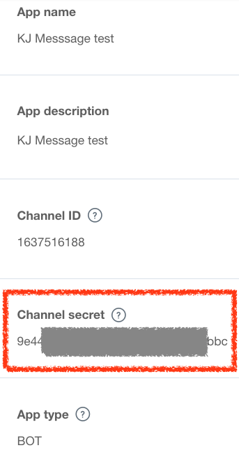

`<channel access token>` 一開始沒有，需要點選 `Issue` 按鈕產生

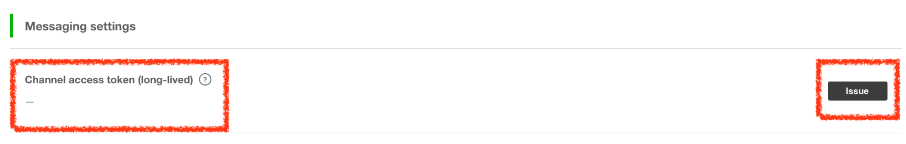

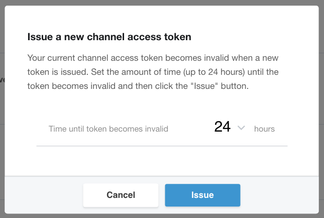

建立完成後即可看到產生的 `<channel access token>`

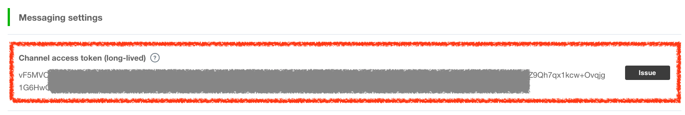


**傳送訊息**


傳入指定的 `Line @` *user id* 即可將訊息推送給訂閱的人


```php
<?php
$response = $bot->pushMessage('<user id>', new TextMessageBuilder('test text1', 'test text2', 'test text3'));
```

*user id* 可以在頻道設定最下方找到

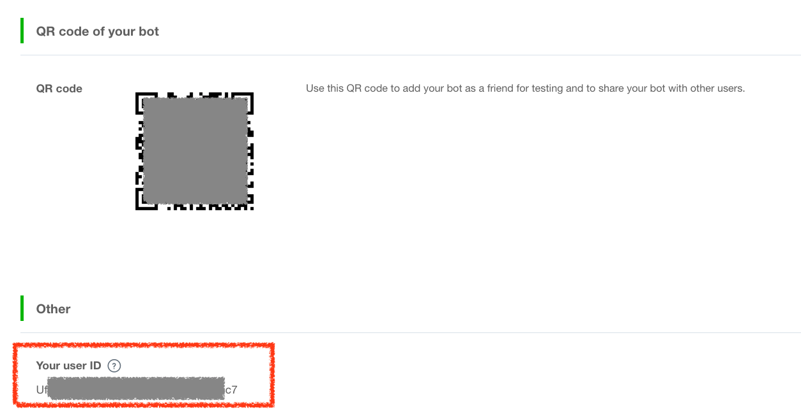

傳送過去後即可看到剛剛設定的訊息

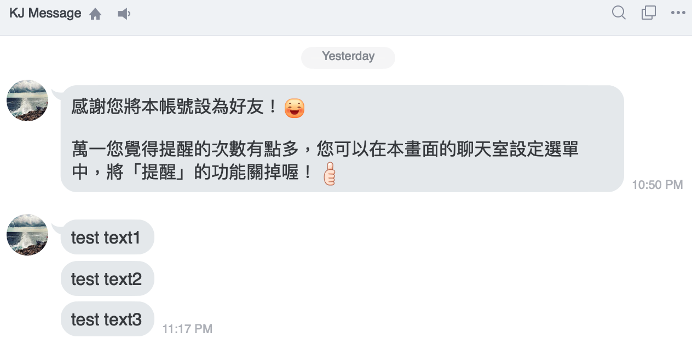

## 參考資料
* [GitHub - line/line-bot-sdk-php: SDK of the LINE Messaging API for PHP](https://github.com/line/line-bot-sdk-php)
* [Messaging API](https://developers.line.biz/en/docs/messaging-api/)
* [Building a sample bot with Heroku](https://developers.line.biz/en/docs/messaging-api/building-sample-bot-with-heroku/)
* [Messaging API reference](https://developers.line.biz/en/reference/messaging-api/)
