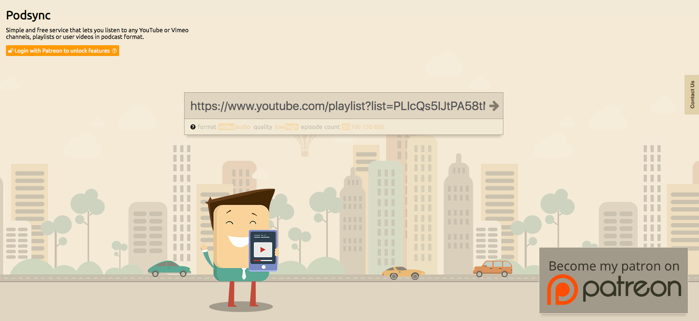
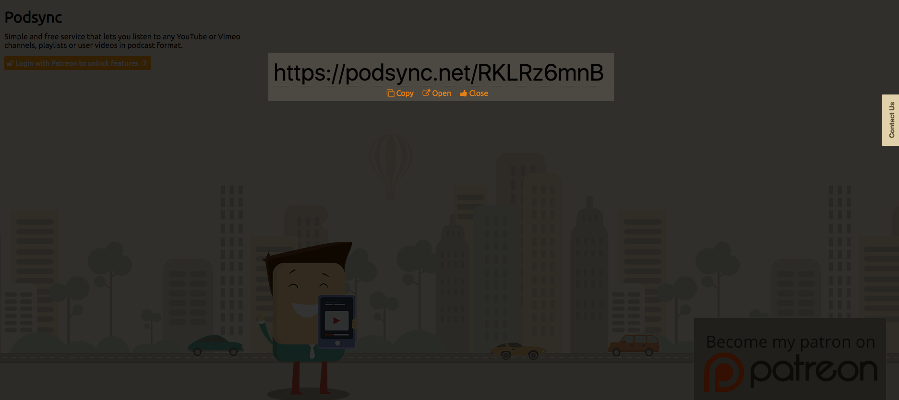
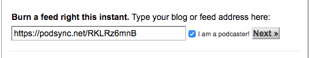

# Youtube

## 頻道 RSS

*頻道網址*

> https://www.youtube.com/channel/`UC4bokYuSrVGpI6_WYv7Gdbw`

*頻道 RSS 網址*

> https://www.youtube.com/feeds/videos.xml?channel_id=`UC4bokYuSrVGpI6_WYv7Gdbw`

## 播放清單 RSS

*清單網址*

> https://www.youtube.com/playlist?list=PLIcQs5IJtPA58tMHKfJJaaxLEJyRtvPWP

> https://www.youtube.com/feeds/videos.xml?playlist_id=PLIcQs5IJtPA58tMHKfJJaaxLEJyRtvPWP

## 將 Youtube 播放清單登入至 itunes podcast

*1. 將 Youtube 播放清單網址貼入 Podsync*

> 清單網址：https://www.youtube.com/playlist?list=PLIcQs5IJtPA58tMHKfJJaaxLEJyRtvPWP

*2. 取得 RSS 連結*

> RSS 連結：https://podsync.net/RKLRz6mnB

*3. 貼入 RSS 連結至 feedburner*

feedburner: https://feedburner.google.com/fb/a/myfeeds

貼入後勾選 `I am a podcaster!` 再按 Next

*4. 將 feedburner 網址貼至 Podcasts Connect*

輸入 Feed 相關設定後，將 feedburner 網址貼入 Podcasts 即可送出等待驗證

### 相關網站
* [Podsync - Turn YouTube channels into podcast feeds](https://podsync.net/)
* [feedburner](https://feedburner.google.com/)
* [Podcasts Connect](https://podcastsconnect.apple.com/my-podcasts)

## 參考資料
* [How to Submit a YouTube Channel to iTunes Podcast Directory Tutorial - YouTube](https://www.youtube.com/watch?v=mTQNTm6-tFI)
